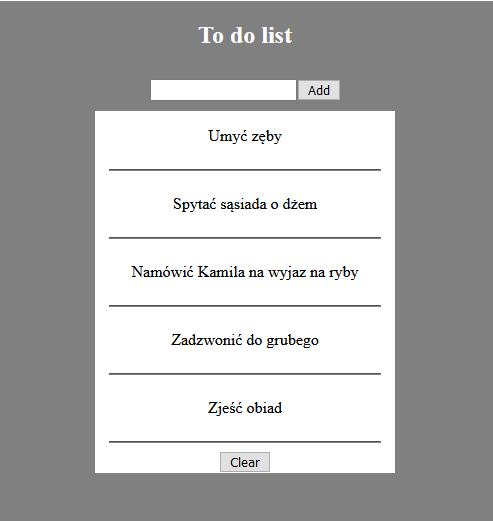
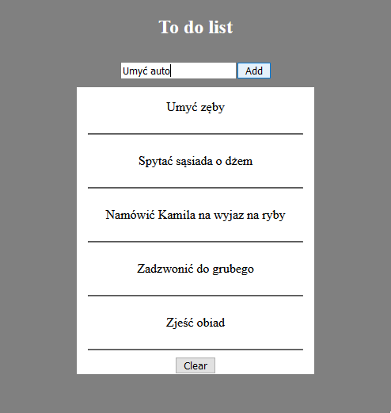
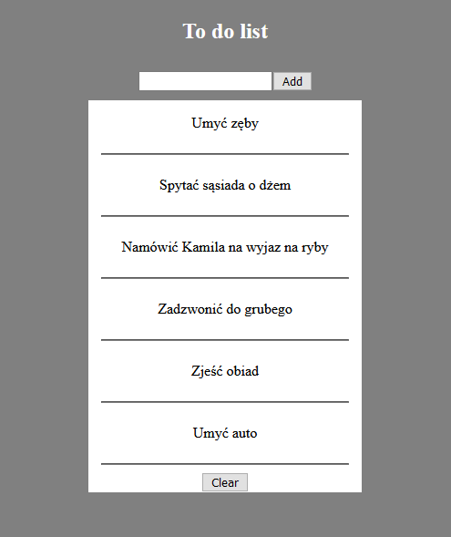
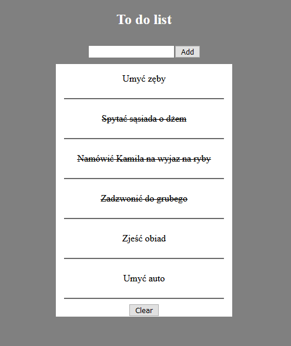
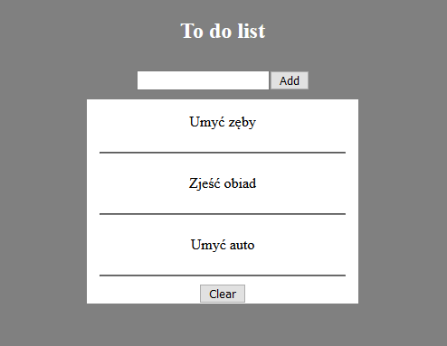

# TODO APP

## Idea
Main idea was to implement an app that could help with organising your tasks to do.
## Technologies
PHP with files support
##How to run
To run the project you have to install xampp, then run xampp controll panel and turn on the Apache Module.
##Usage

The app looks like you can see above.
You can add an item as you can see in the next image

After clicking "Add" button your item is added to a json list. You are not allowed to add an empty string!

You can also delete on item or multiple items by first clicking on its value.
It is gonna change its text style to crossed out.

Then you have to click "Clear" Button, to delete the items.

